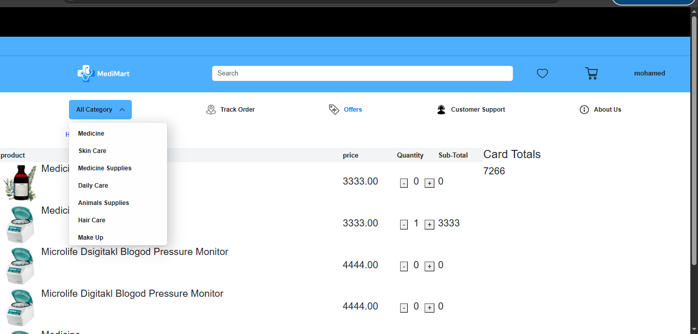

# 💊 MediMart


A full-stack pharmacy e-commerce web application built with Laravel. The project provides an online shopping experience for pharmacy products with an admin dashboard for managing products, categories, brands, and inventory.

---

## 🚀 Features

- User Authentication (Register & Login)
- Browse Products
- Product Categories & Subcategories
- Product Brands
- Product Search
- Shopping Cart
- Wishlist
- Product Details
- Admin Dashboard
- Product Management (CRUD)
- Category Management
- Brand Management
- Image Upload
- Responsive Design

---

## 🛠 Tech Stack

- Laravel
- PHP
- MySQL
- Blade
- HTML5
- CSS3
- Bootstrap
- JavaScript
- Git & GitHub

---

## 📂 Project Structure

- Authentication
- Home Page
- Products
- Categories
- Brands
- Shopping Cart
- Wishlist
- Admin Panel

---

## ⚙️ Installation

```bash
git clone https://github.com/elgohary-mohamed/MediMart.git

cd MediMart

composer install

npm install

cp .env.example .env

php artisan key:generate

php artisan migrate

npm run dev

php artisan serve
```

---
## 📸 Screenshots

### 🏠 Home


### 🔍 Search


### 🛒 Shopping Cart


### ❤️ Wishlist


### 📝 Register


### 🔑 Login


### 📂 Categories


### ➕ Add Product


### ➕ Add Category


### ➕ Add Brand


### ➕ Add Subcategory


### 🎁 Offers

---

## 👨‍💻 Author

**Mohamed Elgohary**

GitHub:
https://github.com/elgohary-mohamed
